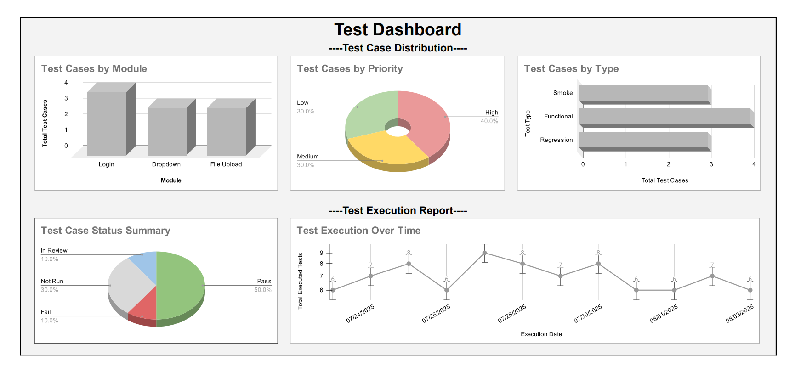

# 🚀 Playwright End-to-End Test Automation Framework

[](./LICENSE)

A **robust**, **scalable**, and **modular** automation framework built using `Playwright` and `TypeScript`.  
Designed for both **freelance projects** and **production environments**, it follows industry best practices with a clean architecture, reusable components, and flexible test execution.

---

## 🔑 Key Features

- Built with `Playwright` + `TypeScript` using the **Page Object Model (POM)**
- Clean, modular folder structure with clear **naming conventions**
- Supports multiple test types: `@smoke`, `@functional`, `@regression`
- Test cases follow **JIRA-style IDs** and **action-based naming**
- Fully **externalized** locators, test data, and UI messages
- Enables **parallel test execution** across devices and browsers
- Auto-captures **screenshots and video** on failure
- Simple script execution via pre-defined `npm` commands
- **Cross-browser ready** — uses `Chromium` by default, configurable for others

---

## 📁 Folder Structure Overview

The project is organized for modularity, scalability, and ease of maintenance — following best practices for Playwright with the Page Object Model.

```bash
playwright-portfolio/
├── src/
│   ├── pages/                     # Page Objects organized by feature
│   │   ├── basePage.ts            # Common methods for all pages
│   │   └── page1/
│   │       ├── page.ts            # page1Page extends BasePage
│   │       └── locators.ts        # page1 page locators
│   ├── tests/                     # Test cases grouped by feature; tagged with @smoke, @regression, @functional
│   │   ├── test-feature1.spec.ts
│   │   ├── test-feature2.spec.ts
│   │   └── test-feature3.spec.ts
│   ├── utils/                     # Reusable helpers
│   │   ├── constants.ts           # UI messages and texts
│   │   ├── testData.ts            # Centralized test data
│   │   └── fileUtils.ts           # File upload helpers
│   └── fixtures.ts                # Shared test fixtures
├── test-results/                  # Playwright auto-generated reports
├── .gitignore                     # Excludes node_modules, logs, and test artifacts
├── package.json
├── playwright.config.ts           # Test configuration file
├── README.md
```

---

## 🧪 Test Case Naming Standard

- Format: `@tag TC-ID should <action>`
- Example:  
  `test('@smoke TC-001 should login successfully with valid credentials', () => { ... });`

This ensures test cases are easily traceable and action-focused — ideal for linking with test management tools or JIRA.

---

## ⚙️ Configuration Details

- `baseURL`: Enables relative path navigation within tests
- `headless`: Tests run in headless mode by default (can be changed)
- `video`, `screenshot`: Automatically saved **on failure** for easier debugging
- **Cross-browser testing** supported — just uncomment desired projects in `playwright.config.ts` (e.g., `firefox`, `webkit`)

---

## 📦 Available NPM Scripts

You can execute tests using the following pre-defined commands:

| Command                    | Description                                         |
|----------------------------|-----------------------------------------------------|
| `npm run test`             | Run all tests in **headless** mode                  |
| `npm run test:headed`      | Run all tests in **headed** (visible browser) mode  |
| `npm run test:ui`          | Open the **Playwright Test UI**                     |
| `npm run test:smoke`       | Run only tests tagged with `@smoke`                 |
| `npm run test:regression`  | Run only tests tagged with `@regression`            |
| `npm run test:debug`       | Run tests in **debug** mode with **trace viewer**   |

> All scripts are pre-configured in `package.json` for easy execution and client convenience.

---

## 🧭 Coding Best Practices Followed

- `expect()` is used **only in test files** — never inside Page Objects
- **No logic duplication** — reusable methods across page classes
- **Modular design** for easy scaling and maintenance
- Consistent **naming conventions** and **code formatting**
- Clear, concise **comments** wherever logic needs explanation
- `.gitignore` and **environment safety** pre-configured to avoid leaking test data or local artifacts

---

## 🧩 Sample Features Covered

- Login with **valid/invalid credentials**
- Dropdown selections — static, searchable, and custom
- File uploads — standard, drag & drop, and custom file pickers

---

## 🧪 Sample Test File Locations

- `src/tests/login.spec.ts`
- `src/tests/file-upload.spec.ts`
- `src/tests/dropdown.spec.ts`

---

## 📊 Test Reports

- HTML reports are auto-generated under `/playwright-report`
- **Screenshots and videos** are captured on test failure
- **Trace viewer** available in debug mode for deep inspection

---

## 📄 Test Case Template (Excel + PDF)

This project includes a **professional, client-ready test case template**, built for structured manual QA planning, tracking, and reporting.

**Key Features:**
- Executive-style **Dashboard** with test metrics and visual indicators
- **Module-wise test planning** with separate sheets for each feature
- Smart dropdowns for:
  - Test Type (Smoke, Regression, etc.)
  - Status (Not Run, Pass, Fail, etc.)
  - Priority (Low, Medium, Critical)
  - Tester & Execution Date (with calendar picker)
- **Freezed headers** and protected data areas for safe editing
- **Summary view with charts**, filtered stats, and test tracking overview
- **PDF export-ready** for quick client reporting

📁 **Files Included** (in [`test-artifacts/`](./test-artifacts/)):
- [`test-case-template.xlsx`](./test-artifacts/test-case-template.xlsx) – Editable Excel template
- [`test-case-dashboard.pdf`](./test-artifacts/test-case-dashboard.pdf) – Preview version for sharing

📝 **Note**: The test case data in this template is for demonstration purposes only.  
It includes a mix of `Pass`, `Fail`, `No Run`, and `Blocked` statuses to simulate a real-world QA project.  
All automated test cases in this Playwright framework currently pass successfully.

🔗 **Interactive View (Google Sheet)**:  
You can also preview the fully functional and visual-rich version here:  
👉 [Google Sheet (View Only)](https://docs.google.com/spreadsheets/d/1gBczB6KFnLDqWGXs17fa6ba-BBoQTUBqqJXG5a20djc/edit?gid=0#gid=0)

💼 **Why Clients Love This Template**
- **Time-Saving**: Reuse for any project — no need to create a structure from scratch
- **Client-Ready**: Polished dashboard with exportable PDF for stakeholder reports
- **Customizable**: Add your modules, testers, and execution data easily
- **Professional Look**: Clean UI, visual tracking, and organized layout make it easy for both QA teams and non-technical stakeholders

This isn’t just a test case sheet — it’s a **full reporting and planning system** for real QA projects.

📸 **Preview Snapshot:**


---

## 🤝 What I Can Offer Clients

- Build Playwright automation frameworks from scratch with scalable architecture
- Convert existing **manual test cases** into automated test suites
- Integrate **CI/CD pipelines** and cross-browser/device test strategies
- Maintain, refactor, and expand automation coverage over time
- Deliver **clear reports**, test tagging, and documentation for stakeholders
- Provide fast, reliable, and **production-ready automation solutions** tailored to your application

---

## 🌐 Custom Test Website

All test scenarios were designed and validated using my own hosted demo site:

🔗 **RapidTest** – [https://markadvk.github.io/rapidtest/](https://markadvk.github.io/rapidtest/)

A lightweight frontend app simulating:
- Login workflows
- Dropdown behavior (static & dynamic)
- File uploads (including drag-and-drop)

Perfect for real-world E2E test practice and showcasing automation skills.

---

## ✅ Conclusion

This framework is **battle-tested**, highly maintainable, and ready to scale.  
Ideal for clients seeking **professional-grade automation** with clean code, modular structure, and full end-to-end coverage.

Need help automating your web app?

**Let’s bring quality, speed, and stability to your software through high-standard testing.**

📬 Reach out via to me — your test coverage is one message away.


🔖 **About / Contact** -
Maintained by VerifyKoders — QA & Automation Portfolio

🌐 Website: https://markadvk.github.io/verifykoders/

▶️ YouTube: https://www.youtube.com/@verifykoders

License: This project is licensed under the [MIT License](./LICENSE)

© 2025 VerifyKoders. All rights reserved.